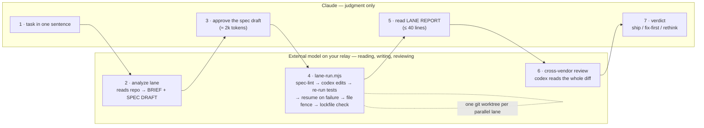
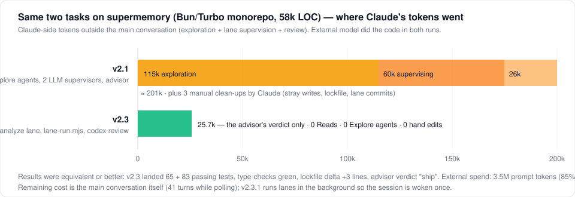

# delegating-to-external-llm

[](https://github.com/ypyik0669/delegating-to-external-llm/actions/workflows/ci.yml)

**English** | [中文](README.zh-CN.md)

A Claude Code plugin that turns Claude into the **architect** and hands **analysis, implementation and code review** to an external model on **your own OpenAI-compatible relay** (any base URL + API key). The external model reads the repo and drafts the spec; deterministic scripts drive it to implement and verify; it reviews the diff cross-vendor; Claude only decides, approves, and gives the final verdict. Claude never reads the codebase to learn it, never types the code, and never babysits a lane.

No agent in this plugin pins a model. Lanes run whatever `LLM_MODEL` you configure; everything else runs on your session model. Only you switch models.

Modeled on the architect pattern from [fable-advisor](https://github.com/DannyMac180/fable-advisor) by Dan McAteer, adapted to a single relay-served model with two delivery mechanisms and hard enforcement.

## Why

- **Spend the premium on judgment, not typing.** Claude's tokens go to decomposition, specs and verdicts; the relay model does the volume.
- **Cross-vendor by construction.** The code comes from a non-Anthropic model; Claude's verification and the advisor's review are real second opinions.
- **No silent drift.** Specs are linted before a lane spends anything, edits are fenced to the spec's FILES, lanes fail loudly (`unavailable`, `refused`, `SCOPE VIOLATION`), reports carry the verification the lane re-ran itself, and an optional hook physically blocks Claude from editing repo files while delegation is on.
- **Evidence, not vibes.** Every lane call lands in a usage ledger with a `claude : external` token ratio, so you can see who actually did the work (target ≥ 1 : 5).
- **Claude pays only for judgment.** Reading the code, supervising lanes and reviewing diffs all run on the external model or in scripts; Claude's job per task is roughly: read a 30-line brief, edit a spec, read a 40-line report, give a verdict.

## How it works



Claude never opens a source file to learn the codebase, never types implementation code, and never supervises a lane turn by turn. Every external call lands in a ledger, so the `claude : external` token ratio is visible.

| Lane | How the model runs | Agent | When |
|---|---|---|---|
| Analyze | `codex exec` read-only by contract; returns a ≤30-line brief + six-part spec draft | `lane-run.mjs --analyze` / `codex-analyst` | Every task, before the spec |
| Implement (default) | `lane-run.mjs`: spec-lint → `codex exec` on your relay (private `CODEX_HOME`, permission level `workspace` / `workspace-net` / `yolo`) → independent verification → resume on failure → LANE REPORT | `lane-run.mjs` / `codex-implementer` | Any implementation task |
| Chat / fallback | `scripts/llm.mjs` chat completions; the agent applies the reply verbatim | `relay-implementer` | codex unavailable, a task failed twice, or you want the audited four-call trail (`PROTOCOL: four-phase`) |
| Review | `codex-lane.sh --review` (external reads the diff) then Claude judges | `llm-advisor` | Commitment boundaries + mandatory end-of-deliverable review |

Reasoning effort is named **per task** in the spec (`REASONING: low|medium|high|xhigh`), never pinned globally.


## Measured

Two real tasks on [supermemory](https://github.com/supermemoryai/supermemory) (Bun/Turbo monorepo, ~58k LOC): add vitest coverage to a pure module and wire its test script; replace a loose `filters: z.string()` with a typed recursive AND/OR schema plus tests. Same prompt, no trigger phrase, two versions of this plugin.



| | v2.1 (agents supervise) | v2.3 (scripts supervise) |
|---|---|---|
| Claude reads source / Explore agents | 3 agents, ~115k tokens | **0** |
| Claude supervising lanes | 2 sonnet agents, ~60k | **0** (lane-run.mjs) |
| Claude review | 26k | 25.7k (after a codex review) |
| Claude hand fixes after lanes | 3 (stray writes, lockfile, lane commits) | **0** |
| Claude-side tokens outside the main chat | **≈ 201k** | **≈ 26k** |
| External model | 4.3M prompt (85% cached) | 3.5M prompt (85% cached), 27k out |
| Outcome | 13 + 36 tests, advisor: ship | **65 + 83 tests**, lockfile +3 lines, advisor: ship |

Single-bug smoke test (headless `claude -p`, no trigger phrase): 7 turns, $1.06, analyze → implement → review, Claude edited nothing.

Honest caveats: the external model's base cost is codex's own ~20k-token system prompt per run; cache hits make most of the 3.5M cheap but your relay's pricing decides; the main conversation's own tokens are not in the ledger — keep the session small (see "Session hygiene" in the skill).

## 60-second quickstart

```
claude plugin marketplace add ypyik0669/delegating-to-external-llm
claude plugin install delegating-to-external-llm@delegating-to-external-llm
node ~/.claude/plugins/…/delegating-to-external-llm/scripts/setup.mjs   # or: /delegating-to-external-llm:setup inside Claude Code
```

Then open Claude Code in any repo and describe a task the way you always did. Nothing else to say — the plugin's hook makes every coding task go through the lanes.

## What you actually see

A lane returns a fixed, ≤ 40-line report (this one is from the supermemory run):

```
LANE REPORT
LANE: codex-implementer (relay model, effort: medium) · driver: lane-run.mjs (no LLM supervisor)
STATUS: complete
CHANGES:
  - packages/lib/package.json
  - packages/lib/similarity.test.ts
  - bun.lock
VERIFIED:
  $ bun run --cwd packages/lib test → exit 0 (expected: all passing)
      Tests  65 passed (65)
  $ bun run --cwd packages/lib check-types → exit 0
MODEL SAID: Added vitest coverage for every export; lockfile regenerated with bun 1.3.6 (+3 lines).
ROUNDS: 1 — fresh in=994k cached=951k out=6.2k → ran
GAPS: none
```

And the ledger (`/delegating-to-external-llm:usage`):

```
who did the work
  external      8 calls   3,463,814 prompt   2,941,086 cached   26,948 output   60.1 min
  claude        5 calls      34,700 prompt           0 cached    2,500 output
  claude : external tokens = 1 : 93.8   (target ≥ 1 : 5)
```

## What Claude does and doesn't do

| Claude does | Claude never does |
|---|---|
| States the task, answers the analyze lane's open questions | Opens source files to understand the code |
| Edits and approves the six-part spec | Writes implementation code or tests |
| Splits work into disjoint specs, one worktree each | Fixes a lane's diff, lockfile, or stray write by hand |
| Reads lane reports, sends corrected specs | Supervises a lane turn by turn |
| Gives the final verdict after the codex review | Reports "done" without the ledger line |

## FAQ

**Is this cheaper?** Claude-side spend outside the main chat dropped from ~201k to ~26k tokens on the same two tasks (see Measured). The external model's cost depends on your relay's pricing; ~85% of its prompt tokens were cache hits in our runs. The remaining Claude cost is the main conversation itself — keep it small.

**Which models?** Whatever you configure. Lanes run `LLM_MODEL` on your relay; Claude and every agent run on your session model. The plugin never pins or switches a model.

**What if the relay or codex is down?** Lanes report `unavailable` and Claude tells you. It does not "just do it itself" — that is the point.

**Can I turn it off for a session?** Disable the plugin, or start Claude Code with `LLM_DELEGATION=0`.

**How is this different from fable-advisor?** Same architect idea, but: any OpenAI-compatible relay instead of a ChatGPT login; deterministic scripts instead of LLM supervisors; an analyze lane so Claude never reads the repo; file fence, lockfile check, stray-write guard; a two-sided ledger; and a hook that triggers without a phrase.

## Requirements

- Claude Code ≥ 2.1.x
- Node ≥ 18
- An OpenAI-compatible relay: base URL + API key (`/v1/chat/completions`; `/v1/responses` too if you want the agentic lane)
- Optional, for the agentic lane: [OpenAI Codex CLI](https://github.com/openai/codex) ≥ 0.155 (`npm i -g @openai/codex@latest`). No `codex login` needed — the lane points codex at your relay.
- Windows: Git Bash (ships with Git for Windows)

## Install

**From GitHub (recommended):**

```
claude plugin marketplace add ypyik0669/delegating-to-external-llm
claude plugin install delegating-to-external-llm@delegating-to-external-llm
```

**Or clone into the skills directory** (auto-discovered in place as `delegating-to-external-llm@skills-dir`, edits take effect immediately):

```
git clone https://github.com/ypyik0669/delegating-to-external-llm ~/.claude/skills/delegating-to-external-llm
```

**Or one-off:** `claude --plugin-dir /path/to/delegating-to-external-llm`

Restart Claude Code. `/plugin list` shows the plugin; `/agents` lists `codex-implementer`, `relay-implementer`, `llm-advisor`.

## Setup — your relay and key

Run the interactive setup **in your own terminal** (the key is typed with echo off and written to `~/.claude/llm-relay.env` with mode 600; it is never pasted into the chat):

```
node ~/.claude/skills/delegating-to-external-llm/scripts/setup.mjs
```

It asks for:

| Prompt | Meaning |
|---|---|
| Relay base URL | e.g. `https://relay.example.com` (no `/v1`) |
| API key | echo off |
| Model | default `gpt-6-astra`; any slug your relay serves |
| Default reasoning effort | `low|medium|high|xhigh`, used when a spec omits `REASONING:` |
| Minimum input tokens | `0` unless your relay rejects small requests; then e.g. `2000` and `llm.mjs` pads short prompts automatically |
| codex permission level | `workspace` (repo-only, no network — default), `workspace-net` (repo + network), `yolo` (no sandbox, no approval prompts: the model can do anything your account can) |

Then it smoke-tests the relay and reports whether codex is present. Non-interactive:

```
node scripts/setup.mjs --base https://relay.example.com --key sk-... --model gpt-6-astra --reasoning xhigh --min-input 0 --codex-access workspace
```

Inside Claude Code, `/delegating-to-external-llm:setup` walks you through the same thing (and `--check` re-verifies).

That's it. **Installed = on.** Every coding task in every session goes through the plugin without you saying anything: a `SessionStart`/`UserPromptSubmit` hook injects a one-paragraph reminder each turn (so it survives compaction), and the edit gate blocks Claude from touching repo files by hand. To code normally again, disable the plugin (`/plugin` → disable). No edit to `~/.claude/CLAUDE.md` is needed.

## Use

Tell Claude:

> delegate all coding to the external model; you are only the brain.

Claude loads the skill and, per task: runs the analyze lane, edits the spec draft it gets back, runs `lane-run.mjs` (batched when tasks are independent, one worktree each), reads the LANE REPORTs, consults `llm-advisor`, and reports with the ledger line. Commands: `/delegating-to-external-llm:analyze <task>`, `:lane <spec…>`, `:usage`, `:setup`.

Start delegation in a fresh session (or after `/compact`) with `/effort low`: every background notification re-enters your whole context.

### The spec contract (`templates/spec.md`)

```
OBJECTIVE:     what to build or change, one paragraph
FILES:         exact paths (disjoint per parallel lane)
INTERFACES:    signatures / types / API shapes to match
CONSTRAINTS:   conventions, things not to touch, CRLF note on Windows
VERIFICATION:  exact command(s) + expected outcome
REASONING:     low | medium | high | xhigh
MODEL:         optional override
PROTOCOL:      four-phase   (optional, chat lane: analysis → failing tests → implementation → self-review)
```

A spec with code in it is a spec that hasn't been delegated yet. Lanes run `scripts/spec-lint.mjs` first and refuse incomplete specs (missing parts, invalid `REASONING`, globs in `FILES`, more than 15 fenced code lines).

### The lane report

Every lane returns:

```
LANE REPORT
LANE: codex-implementer (gpt-6-astra via relay, effort: high)
STATUS: complete | partial | timeout | unavailable | refused
OBJECTIVE / CHANGES / VERIFIED (re-run by the lane, verbatim counts) / MODEL SAID / ROUNDS / JUDGMENT CALLS / GAPS / REASON
```

An empty diff is `refused`, never `complete`. A missing CLI or dead relay is `unavailable`. A file changed outside the spec's FILES is a `SCOPE VIOLATION` and the lane reports `partial`. No lane ever falls back to Claude writing the code.

### Parallel tasks — one worktree per lane

```
bash scripts/lane-worktree.sh create <slug>   # .lanes/<slug> on branch lane/<slug>; put the path in the spec as WORKTREE:
bash scripts/lane-worktree.sh check  <slug>   # dry-run merge, lists conflicting files
bash scripts/lane-worktree.sh merge  <slug>   # merge --no-commit (you commit), remove worktree
bash scripts/lane-worktree.sh cleanup
```

File sets must be disjoint and hotspot files (routes, config, registries, manifests) belong to exactly one spec. Conflicts go back to the lane as a corrected spec; the architect never resolves them by hand.

### Usage ledger

Every lane call appends to `~/.claude/llm-usage.jsonl`. `node scripts/usage.mjs --since 24h` (or `/delegating-to-external-llm:usage`) shows calls, prompt / cached / output tokens and wall time by lane, status and project, plus a **`claude : external` ratio** — record Claude-side subagent spend with `usage.mjs --claude-in <n> --claude-out <n>` so the ratio is honest. Set `LLM_PRICE_*` / `CLAUDE_PRICE_*` in the env file for USD.

## Hooks

Three plugin hooks, active whenever the plugin is enabled (`LLM_DELEGATION=0` silences them for one session):

- `delegation-context.mjs` (`SessionStart`, `UserPromptSubmit`) — injects the per-turn reminder; at session start also warns if the relay is unconfigured or codex is missing.
- `block-direct-edits.mjs` (`PreToolUse`) — blocks Edit / Write / NotebookEdit on repository files from the main session unless a fresh external-model output exists for the current project.

See [hooks/README.md](hooks/README.md).

## Degradation

- No codex → everything routes to `relay-implementer`; the report says so.
- Relay down → both lanes report `unavailable`; Claude reports the blocker and does not write the code.

## Troubleshooting

| Symptom | Cause / fix |
|---|---|
| `HTTP 400 … fewer than N input tokens` | Your relay rejects small requests. Re-run setup with `--min-input N`; `llm.mjs` pads short prompts. |
| `relay error in stream: … overloaded` | The relay sent an error inside a 200 stream. `llm.mjs` retries twice, then reports `unavailable`. |
| `STATUS: unavailable … 401` from the codex lane | Bad key or base URL in `~/.claude/llm-relay.env`. |
| `wire_api = "chat" is no longer supported` | codex ≥ 0.155 only speaks the Responses API; your relay must serve `/v1/responses` for the agentic lane. Otherwise use the chat lane. |
| codex exits 0 but nothing changed | That is `refused`. Read the final message; usually a spec gap or a rule in `~/.codex/AGENTS.md`. The lane preamble opts out of such rules. |
| Windows: codex can't find the repo | The lane script passes `pwd -W`; run lanes from the repo root in Git Bash. |

## Tests and evals

```
npm test                                   # 31 node:test cases: hook, spec-lint, usage ledger, lane driver (stubbed codex)
npm run check                              # node --check + bash -n on every script
claude plugin eval . --tag offline --scaffold --runs 1 --no-publish   # behavioural cases (see evals/README.md)
```

CI runs the same on ubuntu + windows (`.github/workflows/ci.yml`).

## Files

```
.claude-plugin/plugin.json, marketplace.json   manifest + marketplace entry
skills/delegating-to-external-llm/SKILL.md     routing doctrine, spec contract, report format, red flags
agents/codex-implementer.md                    agentic lane (codex exec over your relay)
agents/relay-implementer.md                    chat lane (llm.mjs, verbatim apply, four-phase)
agents/llm-advisor.md                          read-only Claude reviewer
commands/setup, usage, lane, analyze           /delegating-to-external-llm:setup, :usage, :lane, :analyze
hooks/delegation-context.mjs                   per-turn reminder (no trigger phrase needed)
agents/codex-analyst.md                        thin wrapper: analyze lane
scripts/lane-run.mjs                           deterministic lane driver (lint → codex → verify → resume → report; --batch; --analyze)
codex-home/config.toml                         template for the lanes' private CODEX_HOME
templates/analysis-prompt.md                   brief + spec-draft prompt
scripts/setup.mjs                              interactive relay/key/permission setup + smoke test
scripts/llm.mjs                                streaming chat-completions CLI (--spec, -f, --effort, --out, --pad, retries, ledger)
scripts/codex-lane.sh                          codex exec wrapper: implement / --analyze / --review, relay provider, private CODEX_HOME, access level, file fence, stray-write guard, session resume, ledger
scripts/spec-lint.mjs                          refuses incomplete or code-dictating specs
scripts/lane-worktree.sh                       create / check / merge / cleanup one worktree per parallel lane
scripts/usage.mjs, scripts/usage-log.mjs       usage ledger
hooks/hooks.json, hooks/block-direct-edits.mjs optional PreToolUse gate
templates/spec.md, templates/four-phase.md
tests/, evals/, .github/workflows/ci.yml
llm-relay.env.example                          never commit the real one
```

## Security notes

- Credentials live only in `~/.claude/llm-relay.env` (mode 600). The repo's `.gitignore` excludes it.
- Everything you delegate is sent to the relay you configured. Don't send secrets, `.env` files, or customer data; the skill tells the lanes the same.
- The codex lane runs at the permission level you set in `LLM_CODEX_ACCESS`. The default `workspace` is a write-only-inside-the-repo sandbox with no network. `yolo` removes the sandbox and approval prompts entirely — choose it only on machines where you would let the model act as you.

## Credits

Architecture and doctrine adapted from [DannyMac180/fable-advisor](https://github.com/DannyMac180/fable-advisor) (MIT). The 2.1 drift and cost controls follow 2026 findings on multi-agent coding: subagent token multiplication and scope bounding ([MindStudio](https://www.mindstudio.ai/blog/claude-code-subagents-cost-tokens)), context drift and file-level fences ([arXiv 2603.00822](https://arxiv.org/html/2603.00822v1), [Codex KB](https://codex.danielvaughan.com/2026/06/15/agents-md-beyond-init-writing-project-instructions-that-reduce-token-spend-hooks-mcp-skills/)), and worktree isolation vs. coordination ([AgenticFlict](https://codex.danielvaughan.com/2026/07/28/agent-pr-merge-conflicts-concurrent-coding-agents-codex-cli-worktree-isolation-coordination-defence/), [STORM](https://arxiv.org/pdf/2605.20563)).

## License

MIT
