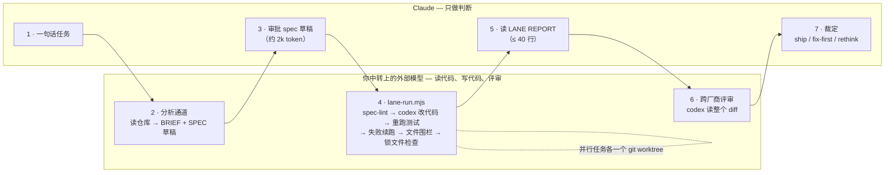
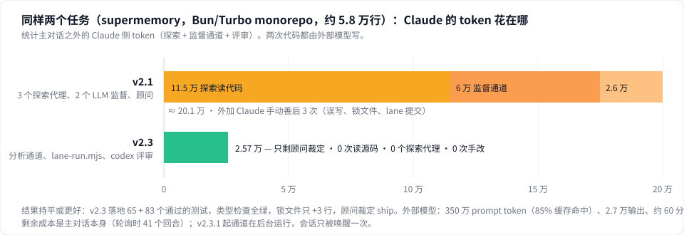

# delegating-to-external-llm

[](https://github.com/ypyik0669/delegating-to-external-llm/actions/workflows/ci.yml)

[English](README.md) | **中文**

一个 Claude Code 插件：让 Claude 只当**架构师**，把**分析、实现、代码评审**都交给你**自己的 OpenAI 兼容中转**（任意 base URL + API key）上的外部模型。外部模型读仓库、起草 spec；确定性脚本驱动它实现和验证；它再跨厂商评审 diff；Claude 只做决定、批 spec、下终审。Claude 不读代码学习仓库、不写实现、不逐轮看管通道。

插件里没有任何代理钉死模型。通道跑你配置的 `LLM_MODEL`，其余全部跟随会话模型，只有你自己能切换模型。

架构模式源自 Dan McAteer 的 [fable-advisor](https://github.com/DannyMac180/fable-advisor)，改造为"单一中转模型 + 两种投递方式 + 硬性门禁"。

## 为什么

- **贵的 token 花在判断上，不花在打字上。** Claude 的 token 用于拆解、写 spec、下裁定，中转模型负责出量。
- **天然跨厂商交叉检查。** 代码来自非 Anthropic 模型，Claude 的验证和顾问评审是真正的第二意见。
- **不会悄悄漂移。** spec 先过静态检查再花钱，改动被围栏限制在 spec 的 FILES 内，通道失败会大声报告（`unavailable`、`refused`、`SCOPE VIOLATION`），报告里带通道自己重跑的验证结果，可选钩子在委托模式下物理禁止 Claude 直接改仓库文件。
- **靠证据，不靠感觉。** 每次通道调用都记入用量账本，并给出 `claude : external` token 比例，一眼看出到底是谁在干活（目标 ≥ 1 : 5）。
- **Claude 只为判断付费。** 读代码、看管通道、评审 diff 都在外部模型或脚本里跑；Claude 每个任务的工作量约等于：读 30 行 brief、改一份 spec、读 40 行报告、下一个裁定。

## 工作方式



Claude 不打开源码学习仓库、不写实现代码、不逐轮看管通道。每次外部调用都记入账本，`claude : external` 的 token 比例一目了然。

| 通道 | 模型运行方式 | 代理 | 何时用 |
|---|---|---|---|
| 分析 | `codex exec` 契约只读；返回 ≤30 行 brief + 六段式 spec 草稿 | `lane-run.mjs --analyze` / `codex-analyst` | 每个任务写 spec 之前 |
| 实现（默认） | `lane-run.mjs`：spec-lint → 中转上的 `codex exec`（私有 `CODEX_HOME`，权限档位 `workspace` / `workspace-net` / `yolo`）→ 独立验证 → 失败续跑 → LANE REPORT | `lane-run.mjs` / `codex-implementer` | 所有实现任务 |
| Chat / 备用 | `scripts/llm.mjs` 聊天补全，代理逐字应用回复 | `relay-implementer` | codex 不可用、同一任务失败两次、或想要可审计的四次调用轨迹（`PROTOCOL: four-phase`） |
| Review | 先 `codex-lane.sh --review`（外部模型读 diff），再由 Claude 裁定 | `llm-advisor` | 关键决策点 + 每次交付前的强制终审 |

推理档位**按任务**写在 spec 里（`REASONING: low|medium|high|xhigh`），不做全局钉死。


## 实测数据

在 [supermemory](https://github.com/supermemoryai/supermemory)（Bun/Turbo monorepo，约 5.8 万行）上做同样两个任务：给一个纯函数模块补 vitest 单测并接上 test 脚本；把 `filters: z.string()` 改成类型化的递归 AND/OR schema 并加测试。同一段提示词、没有触发词、插件两个版本。



| | v2.1（代理监督） | v2.3（脚本监督） |
|---|---|---|
| Claude 读源码 / Explore 代理 | 3 个代理，约 115k token | **0** |
| Claude 监督通道 | 2 个 sonnet 代理，约 60k | **0**（lane-run.mjs） |
| Claude 评审 | 26k | 25.7k（先由 codex 评审） |
| 通道之后 Claude 手动善后 | 3 次（误写、锁文件、lane 提交） | **0** |
| 主对话之外的 Claude token | **≈ 201k** | **≈ 26k** |
| 外部模型 | 4.3M prompt（85% 缓存） | 3.5M prompt（85% 缓存），27k 输出 |
| 结果 | 13 + 36 个测试，顾问：ship | **65 + 83 个测试**，锁文件 +3 行，顾问：ship |

单个 bug 的冒烟测试（无头 `claude -p`，无触发词）：7 回合，$1.06，analyze → implement → review，Claude 没改任何文件。

如实说明：外部模型每次运行有 codex 自身约 2 万 token 的系统提示底噪；3.5M 里大部分是缓存命中，贵不贵取决于你中转的计价；主对话本身的 token 不在账本里，请保持会话精简（见 skill 的"会话卫生"）。

## 一分钟上手

```
claude plugin marketplace add ypyik0669/delegating-to-external-llm
claude plugin install delegating-to-external-llm@delegating-to-external-llm
node ~/.claude/plugins/…/delegating-to-external-llm/scripts/setup.mjs   # 或在 Claude Code 里：/delegating-to-external-llm:setup
```

然后在任意仓库打开 Claude Code，像平时一样描述任务。不用多说一个字，插件的钩子会让每个编码任务走通道。

## 你实际会看到什么

通道返回固定格式、不超过 40 行的报告（这份来自 supermemory 实测）：

```
LANE REPORT
LANE: codex-implementer (relay model, effort: medium) · driver: lane-run.mjs (no LLM supervisor)
STATUS: complete
CHANGES:
  - packages/lib/package.json
  - packages/lib/similarity.test.ts
  - bun.lock
VERIFIED:
  $ bun run --cwd packages/lib test → exit 0 (expected: all passing)
      Tests  65 passed (65)
  $ bun run --cwd packages/lib check-types → exit 0
MODEL SAID: Added vitest coverage for every export; lockfile regenerated with bun 1.3.6 (+3 lines).
ROUNDS: 1 — fresh in=994k cached=951k out=6.2k → ran
GAPS: none
```

以及账本（`/delegating-to-external-llm:usage`）：

```
who did the work
  external      8 calls   3,463,814 prompt   2,941,086 cached   26,948 output   60.1 min
  claude        5 calls      34,700 prompt           0 cached    2,500 output
  claude : external tokens = 1 : 93.8   (target ≥ 1 : 5)
```

## Claude 做什么、不做什么

| Claude 做 | Claude 绝不做 |
|---|---|
| 说清任务，回答分析通道提出的开放问题 | 打开源码文件去理解代码 |
| 修改并批准六段式 spec | 写实现代码或测试 |
| 把工作拆成互不相交的 spec，各一个 worktree | 手改通道的 diff、锁文件或误写 |
| 读通道报告，回发修正后的 spec | 逐轮看管通道 |
| 在 codex 评审之后给出终审 | 不附账本就汇报"完成" |

## 常见问题

**真的更省吗？** 同样两个任务，主对话之外的 Claude 消耗从约 20.1 万降到约 2.6 万 token（见实测数据）。外部模型的费用取决于你中转的计价；实测中约 85% 的 prompt token 是缓存命中。剩下的 Claude 成本是主对话本身，保持会话精简。

**用什么模型？** 你配什么就是什么。通道跑你中转上的 `LLM_MODEL`；Claude 和所有代理跑你的会话模型。插件从不钉死或切换模型。

**中转或 codex 挂了怎么办？** 通道报 `unavailable`，Claude 如实告诉你，不会"那我自己来"，这正是设计目的。

**能临时关掉吗？** 禁用插件，或用 `LLM_DELEGATION=0` 启动 Claude Code。

**和 fable-advisor 有什么不同？** 架构师思路相同，但：任意 OpenAI 兼容中转而非 ChatGPT 登录；脚本监督而非 LLM 监督；分析通道让 Claude 不用读仓库；文件围栏、锁文件检查、误写守卫；双边账本；无需触发词的钩子。

## 依赖

- Claude Code ≥ 2.1.x
- Node ≥ 18
- 一个 OpenAI 兼容中转：base URL + API key（需要 `/v1/chat/completions`；如要用 agentic 通道还需 `/v1/responses`）
- 可选，agentic 通道需要：[OpenAI Codex CLI](https://github.com/openai/codex) ≥ 0.155（`npm i -g @openai/codex@latest`）。不需要 `codex login`，通道脚本会把 codex 指向你的中转。
- Windows：Git Bash（随 Git for Windows 安装）

## 安装

**从 GitHub 安装（推荐）：**

```
claude plugin marketplace add ypyik0669/delegating-to-external-llm
claude plugin install delegating-to-external-llm@delegating-to-external-llm
```

**或 clone 到 skills 目录**（原地自动识别为 `delegating-to-external-llm@skills-dir`，改文件即时生效）：

```
git clone https://github.com/ypyik0669/delegating-to-external-llm ~/.claude/skills/delegating-to-external-llm
```

**或临时加载：** `claude --plugin-dir /path/to/delegating-to-external-llm`

重启 Claude Code。`/plugin list` 能看到插件，`/agents` 能看到 `codex-implementer`、`relay-implementer`、`llm-advisor`。

## 配置：你的中转和 key

**在你自己的终端**运行交互式配置（key 输入时不回显，写入 `~/.claude/llm-relay.env`，权限 600，永远不会粘贴到聊天里）：

```
node ~/.claude/skills/delegating-to-external-llm/scripts/setup.mjs
```

会依次询问：

| 提示 | 含义 |
|---|---|
| Relay base URL | 例如 `https://relay.example.com`（不带 `/v1`） |
| API key | 不回显 |
| Model | 默认 `gpt-6-astra`，可填你中转支持的任意模型名 |
| Default reasoning effort | `low|medium|high|xhigh`，spec 未写 `REASONING:` 时的默认值 |
| Minimum input tokens | 一般填 `0`；若你的中转拒绝小请求（如"不接受少于 2000 token"），填 `2000`，`llm.mjs` 会自动填充短提示 |
| codex permission level | `workspace`（只能写仓库内、无网络，默认）、`workspace-net`（仓库 + 网络）、`yolo`（无沙箱、不弹确认，模型能做你账号能做的一切） |

随后自动冒烟测试中转，并报告是否检测到 codex。非交互方式：

```
node scripts/setup.mjs --base https://relay.example.com --key sk-... --model gpt-6-astra --reasoning xhigh --min-input 0 --codex-access workspace
```

在 Claude Code 内也可以用 `/delegating-to-external-llm:setup` 走同样流程（`--check` 只做复验）。

到此结束。**装上即开启。** 每个会话里的每个编码任务都自动走插件，你不用再说任何话：`SessionStart`/`UserPromptSubmit` 钩子每轮注入一段简短提醒（所以压缩后也有效），编辑门禁拦住 Claude 手改仓库文件。想恢复正常编码，在 `/plugin` 里禁用插件即可。不需要改 `~/.claude/CLAUDE.md`。

## 使用

对 Claude 说：

> 把所有编码交给外部模型做；你只是大脑。

Claude 会加载 skill，每个任务：先跑分析通道，改它返回的 spec 草稿，运行 `lane-run.mjs`（独立任务批量并行，各自一个 worktree），读 LANE REPORT，咨询 `llm-advisor`，带着账本行汇报。命令：`/delegating-to-external-llm:analyze <任务>`、`:lane <spec…>`、`:usage`、`:setup`。

请在新会话（或 `/compact` 之后）用 `/effort low` 开始委托：每次后台通知都会带着整个上下文重新进入。

### spec 合同（`templates/spec.md`）

```
OBJECTIVE:     要做什么，一段话
FILES:         精确路径（并行通道之间不相交）
INTERFACES:    需要匹配的签名 / 类型 / API 形状
CONSTRAINTS:   项目约定、不能动的东西、Windows 上的 CRLF 提醒
VERIFICATION:  精确的验证命令 + 期望结果
REASONING:     low | medium | high | xhigh
MODEL:         可选覆盖
PROTOCOL:      four-phase   （可选，chat 通道：分析 → 失败测试 → 实现 → 自审）
```

spec 里出现代码，就说明这个任务还没真正委托出去。通道会先跑 `scripts/spec-lint.mjs`，不完整的 spec（缺段、`REASONING` 非法、`FILES` 用通配符、代码围栏超过 15 行）直接拒绝。

### 通道报告

每个通道返回：

```
LANE REPORT
LANE: codex-implementer (gpt-6-astra via relay, effort: high)
STATUS: complete | partial | timeout | unavailable | refused
OBJECTIVE / CHANGES / VERIFIED（通道自己重跑，计数原样）/ MODEL SAID / ROUNDS / JUDGMENT CALLS / GAPS / REASON
```

空 diff 一律是 `refused`，绝不算 `complete`。CLI 缺失或中转挂了是 `unavailable`。改了 spec FILES 之外的文件是 `SCOPE VIOLATION`，通道报 `partial`。任何通道都不会退回到 Claude 自己写代码。

### 并行任务：一个通道一个 worktree

```
bash scripts/lane-worktree.sh create <slug>   # 建 .lanes/<slug>，分支 lane/<slug>；路径写进 spec 的 WORKTREE:
bash scripts/lane-worktree.sh check  <slug>   # 干跑合并，列出冲突文件
bash scripts/lane-worktree.sh merge  <slug>   # 合并但不提交（由你提交），删除 worktree
bash scripts/lane-worktree.sh cleanup
```

文件集必须不相交，热点文件（路由、配置、注册表、依赖清单）只能属于一个 spec。冲突以修正后的 spec 回给通道，架构师不亲手解决。

### 用量账本

每次通道调用追加到 `~/.claude/llm-usage.jsonl`。`node scripts/usage.mjs --since 24h`（或 `/delegating-to-external-llm:usage`）按通道、状态、项目汇总调用数、prompt / cached / output token 和耗时，并给出 **`claude : external` 比例**；用 `usage.mjs --claude-in <n> --claude-out <n>` 记录 Claude 侧子代理消耗，比例才诚实。env 里设 `LLM_PRICE_*` / `CLAUDE_PRICE_*` 可显示美元。

## 钩子

插件启用时三个钩子始终生效（`LLM_DELEGATION=0` 可让单个会话静默）：

- `delegation-context.mjs`（`SessionStart`、`UserPromptSubmit`）——每轮注入提醒；会话开始时若中转未配置或缺 codex 会额外提示。
- `block-direct-edits.mjs`（`PreToolUse`）——拦截主会话对仓库文件的 Edit / Write / NotebookEdit，除非当前项目存在新鲜的外部模型输出文件。

详见 [hooks/README.md](hooks/README.md)。

## 降级路径

- 没有 codex → 全部走 `relay-implementer`，报告会注明。
- 中转挂了 → 两个通道都报 `unavailable`，Claude 报告阻塞，不会自己写代码。

## 排错

| 现象 | 原因 / 处理 |
|---|---|
| `HTTP 400 … 少于 N 个 token` | 中转拒绝小请求。重新运行 setup 并加 `--min-input N`，`llm.mjs` 会填充短提示。 |
| `relay error in stream: … overloaded` | 中转在 200 的流里塞了错误事件。`llm.mjs` 自动重试两次，仍失败则报 `unavailable`。 |
| codex 通道 `STATUS: unavailable … 401` | `~/.claude/llm-relay.env` 里 key 或 base URL 不对。 |
| `wire_api = "chat" is no longer supported` | codex ≥ 0.155 只支持 Responses 协议；中转必须提供 `/v1/responses` 才能用 agentic 通道，否则只用 chat 通道。 |
| codex 退出 0 但什么都没改 | 这就是 `refused`。看最终消息，通常是 spec 有缺口或 `~/.codex/AGENTS.md` 里有规则；通道前言已声明对此类规则的豁免。 |
| Windows 下 codex 找不到仓库 | 通道脚本传的是 `pwd -W`；请在 Git Bash 里从仓库根目录运行。 |

## 测试与评测

```
npm test                                   # 31 个 node:test 用例：钩子、spec-lint、用量账本、通道驱动（桩 codex）
npm run check                              # 所有脚本 node --check + bash -n
claude plugin eval . --tag offline --scaffold --runs 1 --no-publish   # 行为评测（见 evals/README.md）
```

CI 在 ubuntu + windows 上跑同样的检查（`.github/workflows/ci.yml`）。

## 文件

```
.claude-plugin/plugin.json, marketplace.json   清单 + marketplace 条目
skills/delegating-to-external-llm/SKILL.md     路由准则、spec 合同、报告格式、红旗清单
agents/codex-implementer.md                    agentic 通道（codex exec 走你的中转）
agents/relay-implementer.md                    chat 通道（llm.mjs，逐字应用，四阶段）
agents/llm-advisor.md                          只读 Claude 评审
commands/setup, usage, lane, analyze           /delegating-to-external-llm:setup、:usage、:lane、:analyze
hooks/delegation-context.mjs                   每轮注入提醒（无需触发词）
agents/codex-analyst.md                        薄包装：分析通道
scripts/lane-run.mjs                           确定性通道驱动（lint → codex → 验证 → 续跑 → 报告；--batch；--analyze）
codex-home/config.toml                         通道私有 CODEX_HOME 的模板
templates/analysis-prompt.md                   brief + spec 草稿提示
scripts/setup.mjs                              交互式中转 / key / 权限档位配置 + 冒烟测试
scripts/llm.mjs                                流式聊天补全 CLI（--spec、-f、--effort、--out、--pad、自动重试、记账）
scripts/codex-lane.sh                          codex exec 包装：实现 / --analyze / --review、中转 provider、私有 CODEX_HOME、权限档位、文件围栏、误写守卫、会话续跑、记账
scripts/spec-lint.mjs                          拒绝不完整或"口述实现"的 spec
scripts/lane-worktree.sh                       并行通道的 worktree create / check / merge / cleanup
scripts/usage.mjs, scripts/usage-log.mjs       用量账本
hooks/hooks.json, hooks/block-direct-edits.mjs 可选 PreToolUse 门禁
templates/spec.md, templates/four-phase.md
tests/, evals/, .github/workflows/ci.yml
llm-relay.env.example                          真实文件永远不要提交
```

## 安全说明

- 凭据只存在 `~/.claude/llm-relay.env`（权限 600），仓库的 `.gitignore` 已排除。
- 所有委托内容都会发送到你配置的中转。不要发送密钥、`.env` 文件或客户数据；skill 对通道也有同样要求。
- codex 通道按 `LLM_CODEX_ACCESS` 设定的档位运行。默认 `workspace` 是只能写仓库内、无网络的沙箱；`yolo` 完全去掉沙箱和确认提示，只在你愿意让模型以你的身份操作的机器上选它。

## 致谢

架构与准则改编自 [DannyMac180/fable-advisor](https://github.com/DannyMac180/fable-advisor)（MIT）。2.1 的防跑偏和省 token 设计参考了 2026 年关于多代理编码的研究与实践：子代理 token 倍增与范围约束（[MindStudio](https://www.mindstudio.ai/blog/claude-code-subagents-cost-tokens)）、上下文漂移与文件级围栏（[arXiv 2603.00822](https://arxiv.org/html/2603.00822v1)、[Codex KB](https://codex.danielvaughan.com/2026/06/15/agents-md-beyond-init-writing-project-instructions-that-reduce-token-spend-hooks-mcp-skills/)）、worktree 隔离与协调（[AgenticFlict](https://codex.danielvaughan.com/2026/07/28/agent-pr-merge-conflicts-concurrent-coding-agents-codex-cli-worktree-isolation-coordination-defence/)、[STORM](https://arxiv.org/pdf/2605.20563)）。

## 许可证

MIT
